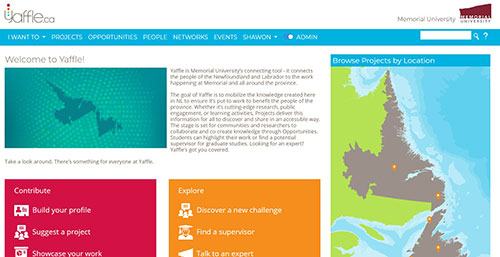
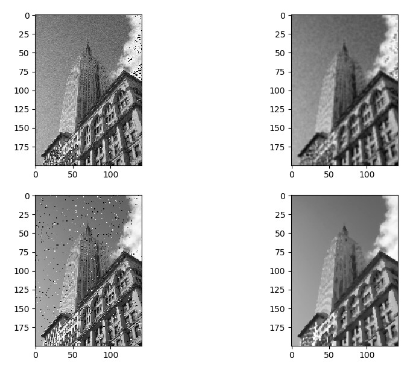

## My Projects

<a href="http://shawon.dev"><< Go back</a>

# Starcraft Competitive AI bot

<a href="https://www.youtube.com/watch?fbclid=IwAR2IoWzLIwAm_sieyDHrSUuWycMaNgmekSkyI2e1QFqQy6PVoKYDr4e3KBc&v=15BO6H5vsY4&feature=youtu.be">Youtube Link</a>

Plays the game of Starcraft: Broodwar as Protoss race using real time Artificial
Intelligence decisions using C++ and BWAPI.

Beats the built-in AI of the game using "Zealot Rush" strategy that includes scouting,
appropriate building placement, proper build order, and timing attacks.

# Share Notes

<a href="https://sharenotes.org">Website Link</a>

The successor of Shawon Notes which is an educational resource platform targeting the British curriculum of high schools reaching over 100k+ monthly page views.

Built in REST API format using React and Laravel to ensure scalability and modularity as I continue to add more features and scale up the project.

Received Spark Fund for getting started with this project from Memorial University.

# Game AI: Procedural Content Generation

Uses Random Number Generation to generate a star system that consists of randomized stars, planets,
moon each with a unique position, temperature, size, and name.

Generated terrain of planets to show land, rocks, and water using Cellular Automata built using C++,
SFML, and Visual Studio.

# Portfalio

Dynamic portfolio management website where user can register accounts and easily setup their portfolio.

Built using REACT, Laravel and MySQL.

# Reinforcement Learning Path Finder

Finds the closest path between each nodes using Q-Learning.

Built using Javascript.

# Ecommerce Web Scraper

<a href="https://github.com/shawonibnkamal/ecommerce-webscraper">Github Link</a>

An ecommerce web scraper namely Best Buy and Walmart. It retrieves product data from the data given the url, and tracks the stock information, price changes and availibility on each update.

Built as part of a group project of 3 using node.js and mongoDB.

# Yaffle

<a href="https://yaffle.ca">Website Link</a>

Rebuilt Yaffle as part of Powered by b project. Yaffle is a collaboration site for researchers and project funders. 

# Distance Map Grid and Vector Field

Calculates the distance of each grid from the target and then uses it to compute a vector field to point to the direction.

# Noise Reduction Filters

Demonstrating Mean filter, Salt and pepper filter and Gaussian blur using Python.

# Shawon Notes

<a href="https://shawonnotes.com">Website Link</a>

The first website I built where I shared my own study materials of IGCSE and IAL to help fellow students. It reaches over 100k page views each month and is the most popular IGCSE/IAL revision website in Bangladesh.

# Game AI: Tron

Tron game AI bot built using C++ and SFML.

# Data Visualization of Yaffle Researchers and  Contributers

Visualization of Yaffle researchers and contributors using D3.js.

# Multi-armed bandit - Reinforcement Learning

Implemented reinforcement learning to maximize reward in the multi-armed bandit problem.