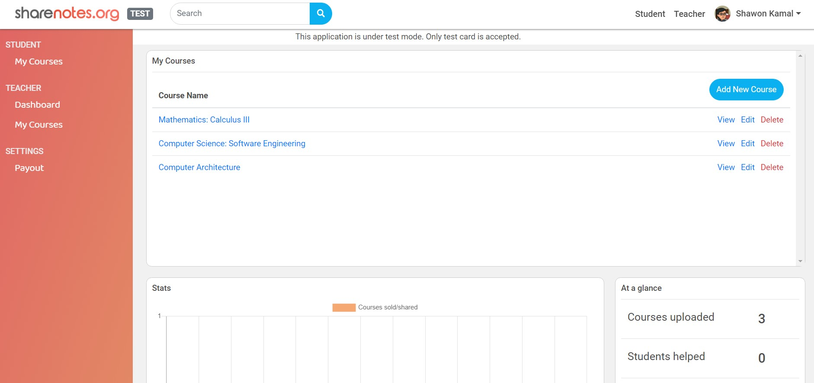
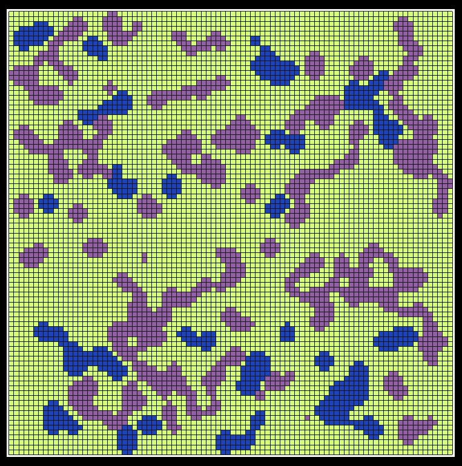
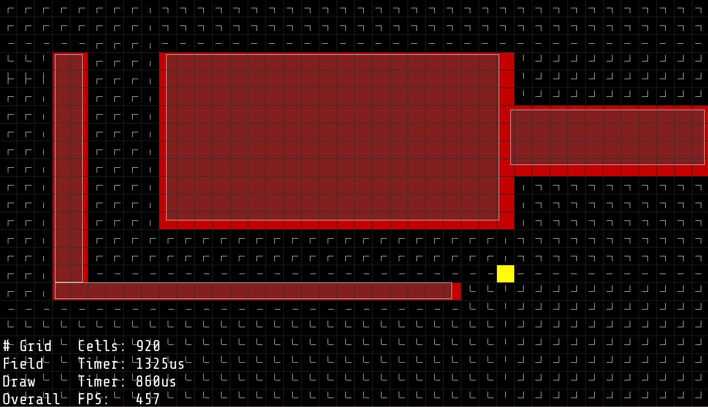
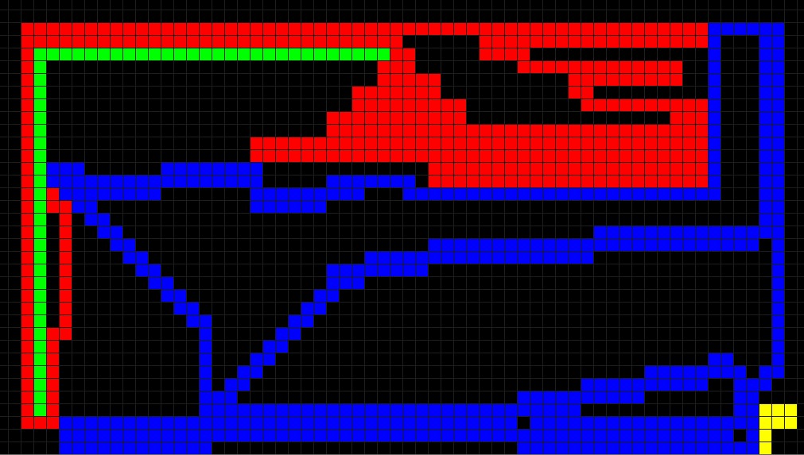

## My Projects

# Starcraft Competitive AI bot

<a href="https://www.youtube.com/watch?fbclid=IwAR2IoWzLIwAm_sieyDHrSUuWycMaNgmekSkyI2e1QFqQy6PVoKYDr4e3KBc&v=15BO6H5vsY4&feature=youtu.be">Youtube Link</a>

Plays the game of Starcraft: Broodwar as Protoss race using real time Artificial
Intelligence decisions using C++ and BWAPI.

Beats the built-in AI of the game using "Zealot Rush" strategy that includes scouting,
appropriate building placement, proper build order, and timing attacks.

# Share Notes

<a href="https://sharenotes.org">Website Link</a>

Plays the game of Starcraft: Broodwar as Protoss race using real time Artificial
Intelligence decisions using C++ and BWAPI.

Beats the built-in AI of the game using "Zealot Rush" strategy that includes scouting,
appropriate building placement, proper build order, and timing attacks.

# Game AI: Procedural Content Generation

Uses Random Number Generation to generate a star system that consists of randomized stars, planets,
moon each with a unique position, temperature, size, and name.

Generated terrain of planets to show land, rocks, and water using Cellular Automata built using C++,
SFML, and Visual Studio.

# Portfalio

# Reinforcement Learning Path Finder

# Ecommerce Web Scraper

<a href="https://github.com/shawonibnkamal/ecommerce-webscraper">Github Link</a>

# Yaffle

<a href="https://yaffle.ca">Website Link</a>

# Distance Map Grid and Vector Field

# Noise Reduction Filters

# Shawon Notes

<a href="https://shawonnotes.com">Website Link</a>

# Game AI: Tron

# Data Visualization of Yaffle Researchers and  Contributers

# Multi-armed bandit - Reinforcement Learning

